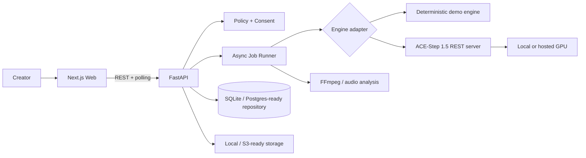

# Architecture

The product and inference runtime are deliberately separate. Auralis owns validation, consent, jobs, persistence, and UX. ACE-Step owns inference behind its published REST server. This minimizes copied code, makes model upgrades safer, and permits a hosted worker later without rewriting the app.

The in-process runner is suitable for an MVP and exposes the same job contract a Redis/RQ or Celery worker would use. Storage and repository interfaces are kept behind service modules so S3 and Postgres can replace local defaults.
